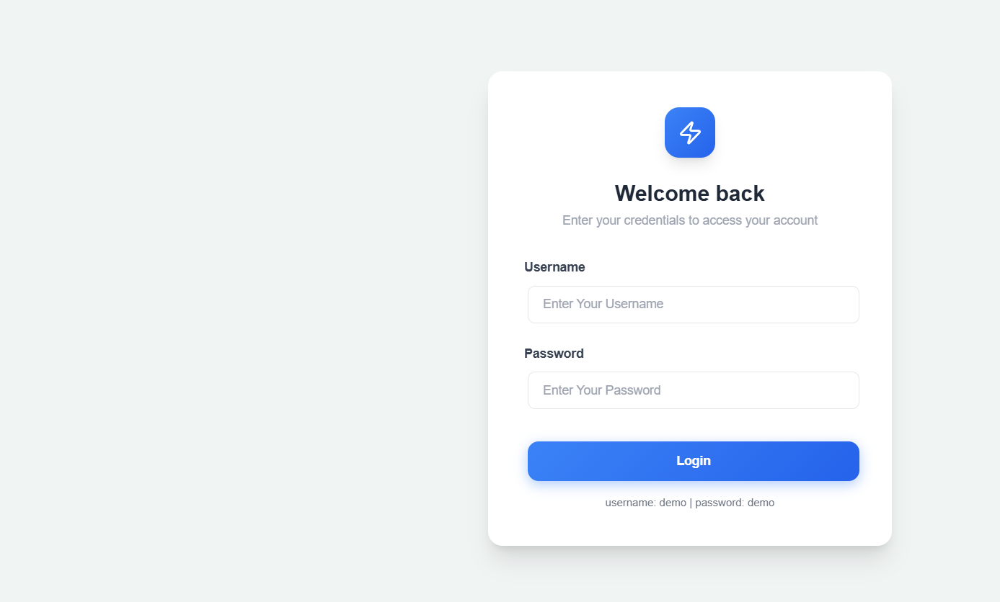
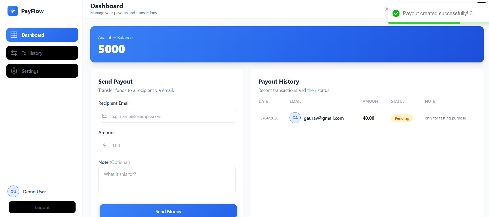
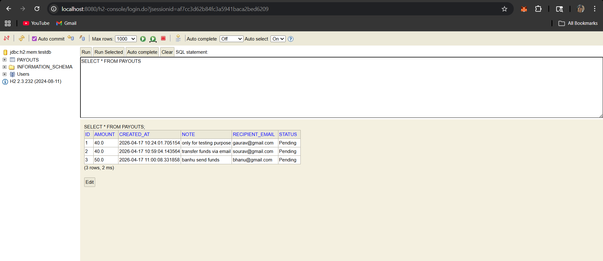

# ATMOONPE - Payout Dashboard

A full-stack **Payout Dashboard** application built with React and Spring Boot for managing payouts and transactions.

## Features

- **Secure Authentication** - JWT-based login system
- **Dashboard Overview** - View available balance and recent activity
- **Payout Management** - Create and track payouts with status updates
- **Transaction History** - Complete payout history with filtering
- **Modern UI** - Clean, responsive interface with Tailwind CSS

## Tech Stack

### Frontend
- **React 18** with Vite
- **TypeScript** for type safety
- **Tailwind CSS** for styling
- **React Router** for navigation
- **Axios** for API calls
- **React Toastify** for notifications

### Backend
- **Java 17** with Spring Boot 3
- **Spring Data JPA** for database operations
- **H2 Database** (in-memory)
- **JWT Authentication** for security
- **Maven** for dependency management

## 📸 Screenshots

### 🔐 Login Page


### 📊 Dashboard


### 📋 H2 Database Console


## Project Structure

```
payout-dashboard/
|
|-- frontend/                          # React frontend
|   |-- src/
|   |   |-- api/                      # API client and HTTP interceptors
|   |   |   |-- authApi.js            # Authentication API calls
|   |   |   `-- httpClient.js         # Axios configuration
|   |   |
|   |   |-- components/               # Reusable UI components
|   |   |   |-- ErrorBoundary.jsx     # Error handling component
|   |   |   |-- LoadingSpinner.jsx    # Loading indicator
|   |   |   |-- PageLoader.jsx        # Full-page loader
|   |   |   |-- ProtectedRoute.jsx    # Route protection wrapper
|   |   |   |-- SendPayoutForm.jsx    # Payout creation form
|   |   |   `-- PayoutHistory.jsx     # Payout history table
|   |   |
|   |   |-- hooks/                    # Custom React hooks
|   |   |   |-- useAuth.js            # Authentication state management
|   |   |   |-- useBalance.js          # Balance fetching logic
|   |   |   `-- usePayouts.js         # Payout CRUD operations
|   |   |
|   |   |-- pages/                     # Page components
|   |   |   |-- Login.jsx             # Login page
|   |   |   `-- Dashboard.jsx         # Main dashboard
|   |   |
|   |   |-- App.tsx                   # Main app component with routing
|   |   `-- main.tsx                  # App entry point
|   |
|   |-- package.json                  # Frontend dependencies
|   `-- vite.config.ts               # Vite configuration
|
|-- backend/                           # Spring Boot backend
|   |-- src/
|   |   |-- main/java/com/atmoonpe/
|   |   |   |-- controller/           # REST API controllers
|   |   |   |-- service/              # Business logic layer
|   |   |   |-- repository/           # Data access layer
|   |   |   |-- entity/               # Database entities
|   |   |   |-- config/               # Security and JWT config
|   |   |   `-- AtmoonpeApplication.java
|   |   `-- main/resources/
|   |       `-- application.properties # Spring Boot configuration
|   |
|   |-- pom.xml                       # Maven dependencies
|   `-- mvnw                          # Maven wrapper
|
`-- README.md                         # This file
```

## Quick Start

### Prerequisites
- **Node.js** (v16 or higher)
- **Java 17** or higher
- **Maven** 3.6+

### 1. Backend Setup

```bash
# Navigate to backend directory
cd backend

# Install dependencies and run
mvn clean install
mvn spring-boot:run
```

The backend will start on **http://localhost:8080**

### 2. Frontend Setup

```bash
# Navigate to frontend directory (new terminal)
cd frontend

# Install dependencies
npm install

# Start development server
npm run dev
```

The frontend will start on **http://localhost:3000**

### 3. Access the Application

1. Open **http://localhost:3000** in your browser
2. Login with credentials:
   - **Username:** `demo`
   - **Password:** `demo`

## API Documentation

### Base URL
```
http://localhost:8080/api
```

### Authentication
All protected endpoints require a JWT token in the Authorization header:
```
Authorization: Bearer <your-jwt-token>
```

### Endpoints

#### 1. Authentication
```http
POST /api/auth/login
```

**Request Body:**
```json
{
  "username": "demo",
  "password": "demo"
}
```

**Response:**
```json
{
  "token": "eyJhbGciOiJIUzI1NiIsInR5cCI6IkpXVCJ9..."
}
```

#### 2. Get Balance
```http
GET /api/balance
Authorization: Bearer <token>
```

**Response:**
```json
5000.00
```

#### 3. Create Payout
```http
POST /api/payouts
Authorization: Bearer <token>
```

**Request Body:**
```json
{
  "recipientEmail": "user@example.com",
  "amount": 100.00,
  "note": "Payment for services"
}
```

**Response:**
```json
{
  "id": 1,
  "recipientEmail": "user@example.com",
  "amount": 100.00,
  "note": "Payment for services",
  "status": "Pending",
  "createdAt": "2026-04-17T01:23:54.231198"
}
```

#### 4. Get All Payouts
```http
GET /api/payouts
Authorization: Bearer <token>
```

**Response:**
```json
[
  {
    "id": 1,
    "recipientEmail": "user@example.com",
    "amount": 100.00,
    "note": "Payment for services",
    "status": "Pending",
    "createdAt": "2026-04-17T01:23:54.231198"
  }
]
```

## Database Access

### H2 Console
Access the in-memory database at: **http://localhost:8080/h2-console**

**Connection Settings:**
- **JDBC URL:** `jdbc:h2:mem:testdb`
- **Username:** `sa`
- **Password:** (leave empty)

### Database Schema
```sql
CREATE TABLE payouts (
  id BIGINT AUTO_INCREMENT PRIMARY KEY,
  recipient_email VARCHAR(255) NOT NULL,
  amount DECIMAL(10,2) NOT NULL,
  note VARCHAR(500),
  status VARCHAR(50) DEFAULT 'Pending',
  created_at TIMESTAMP DEFAULT CURRENT_TIMESTAMP
);
```

## Development

### Frontend Development

```bash
cd frontend
npm run dev          # Start development server
npm run build        # Build for production
npm run preview      # Preview production build
```

### Backend Development

```bash
cd backend
mvn spring-boot:run          # Run application
mvn clean compile            # Compile source
mvn test                     # Run tests
mvn package                  # Create JAR file
```


## Key Features Explained

### Authentication Flow
1. User submits login credentials
2. Backend validates and returns JWT token
3. Token stored in localStorage
4. Axios interceptor adds token to all requests
5. Protected routes check authentication status

### State Management
- **useAuth** - Manages authentication state and token
- **usePayouts** - Handles payout CRUD operations
- **useBalance** - Fetches and manages account balance

### Error Handling
- Global error boundary for React errors
- Toast notifications for user feedback
- Axios interceptors for API errors
- Loading states for async operations

## ⚠️ Challenges Faced

1. Understanding H2 Database

Initially, I was not familiar with H2 Database. I researched:

What is an in-memory database
How H2 works with Spring Boot
Why it's useful for testing (no external DB setup required)

Learning:
H2 is a lightweight, in-memory database that runs inside the application and resets on restart, making it perfect for quick development and testing.

2. Spring Boot Project Setup (Java 17)

Setting up backend with:

Java 17
Spring Boot 3
Maven dependencies

I faced issues in:

Project structure understanding
Proper layering (Controller → Service → Repository → Entity)

Solution:
I followed best practices and created a clean architecture:

controller/
service/
repository/
entity/
config/

Learning:
Proper folder structure makes the project scalable and easier to maintain.

3. JWT Authentication Issue

* JWT compatibility issue with Java 17 (fixed by updating jjwt dependencies)
* Mapping backend response to UI format
* Handling authentication and protected routes cleanly

---

```


## License

This project is licensed under the MIT License.

---